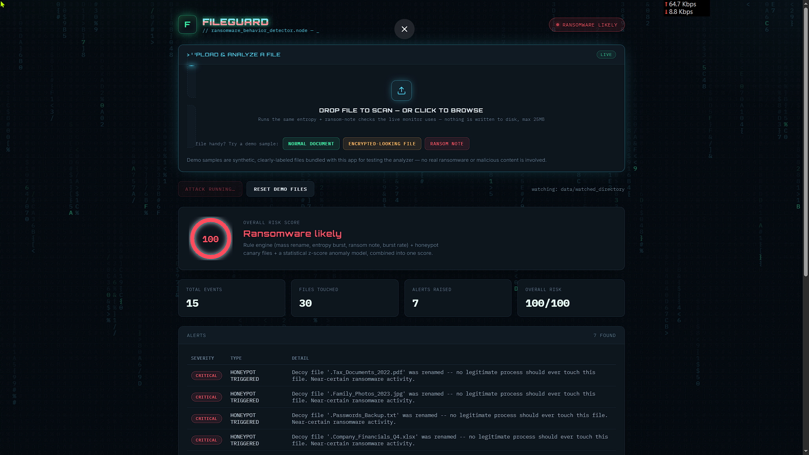

# Ransomware Behavior Detector (Node.js edition)

Monitors a directory tree in real time and detects ransomware-like
**behavior** using a different stack and detection approach than the
Python/Flask version of this project: **Node.js + Express + chokidar**
for monitoring, a **transparent statistical anomaly scorer** (EWMA +
z-scores) instead of a trained ML model, and an added **honeypot
canary-file trap**.

## Screenshot



## How this version differs from the Python/Flask one

| | Python/Flask version | This version |
|---|---|---|
| Runtime | Python | Node.js |
| File watching | `watchdog` (inotify) | `chokidar` |
| Web server | Flask | Express |
| Anomaly detection | trained `IsolationForest` (scikit-learn) | online EWMA baseline + z-score, no training step |
| Extra technique | — | honeypot/canary files |
| Visual style | light "forensics lab" dashboard | dark cyberpunk/techno dashboard (neon glow, scanlines, matrix-rain backdrop) |

The rule engine (mass extension change, entropy burst, ransom note,
burst rate, delete-after-encrypt) is conceptually the same in both —
that part of the detection logic is genuinely stack-agnostic.

## What it detects

| Signal | How | Why it matters |
|---|---|---|
| **Honeypot triggered** | any touch on a seeded decoy file | no legitimate process ever has a reason to touch it — fires instantly, no threshold |
| **Mass extension change** | many files renamed to the same new extension in a short window | `.docx` → `.locked` across a folder is the strongest ransomware fingerprint |
| **High-entropy rewrite burst** | many files' content jumps to ~7.5-8 bits/byte (Shannon entropy) | encrypted content looks like random noise; normal edits don't |
| **Ransom note dropped** | new file matches known ransom-note filename/content patterns | `README_DECRYPT.txt`, "send bitcoin to...", etc. |
| **Mass modification burst** | very high event rate against the tree | encryption sweeps run far faster than a human editing files |
| **Delete-after-encrypt** | a file is deleted right after a high-entropy copy of it appears | some strains encrypt-then-delete instead of renaming in place |
| **Statistical anomaly** | z-score of session features vs. a continuously-updated EWMA baseline | catches sweeps that don't cross any single hard rule threshold |

## A chokidar quirk worth knowing about

Unlike Linux inotify (used by the Python version), chokidar has no
native "rename" event — a rename shows up as a separate `unlink` and
`add`. Testing against this project's own attack simulator showed
chokidar firing **`add` before `unlink`** for a rename, the opposite
of what you'd naively assume. `fileMonitor.js` reconstructs renames
bidirectionally — whichever event arrives first is held briefly to
see if its counterpart (same directory + same base filename) follows
— so the mass-extension-change rule doesn't silently lose its signal
to event-ordering quirks.

## ⚠️ Safety note

`src/simulateAttack.js` does **not** contain or execute any real
malware, encryption routine, or exploit code. It only reproduces the
*observable filesystem pattern* — overwriting files with
`crypto.randomBytes()`, renaming them, and dropping a text file — so
the detection pipeline can be exercised safely. It only ever touches
`data/watched_directory`.

## Project structure
```
ransomware-detector-node/
├── server.js                    # Express server, runs the monitor for the app's lifetime
├── src/
│   ├── entropy.js                # Shannon entropy calculation
│   ├── fileMonitor.js             # chokidar-based watcher + bidirectional rename reconstruction
│   ├── honeypot.js                # canary/decoy file seeding + hit detection
│   ├── ruleEngine.js              # the 5 pattern/threshold detection rules
│   ├── statsAnomaly.js            # EWMA baseline + z-score anomaly scoring
│   ├── detect.js                  # orchestrates rules + honeypot + stats -> report (CLI-runnable)
│   ├── simulateNormal.js          # seeds demo files + normal-activity simulation
│   └── simulateAttack.js          # SAFE simulated ransomware behavior for demos
├── public/
│   ├── index.html
│   ├── styles.css                 # light "forensics lab" theme
│   └── app.js                     # dashboard client logic
├── data/watched_directory/        # the demo folder actually being monitored
└── package.json
```

## Quickstart

```bash
npm install

node server.js
```

Open **http://127.0.0.1:5004**. It seeds demo files and honeypot
canaries automatically, and starts watching `data/watched_directory`
live. Click **"Launch simulated attack"** to safely fire the simulated
ransomware behavior and watch the risk gauge, alerts, and session
table update in real time (the dashboard polls every 2s). Click
**"Reset demo files"** to wipe the attack artifacts and restore clean
demo files + fresh canaries.

### CLI mode

```bash
# watch a directory for 20s and print a report (auto-stops after)
node src/detect.js data/watched_directory 20

# in another terminal while the above is running:
node src/simulateAttack.js
```

### Live raw event feed (no detection, just events)

```bash
node src/fileMonitor.js data/watched_directory
```

## Monitoring a real directory

```bash
node src/detect.js /home/you/Documents 60
```
or edit `WATCH_DIR` in `src/simulateNormal.js`. For production use
you'd also want to:
- let `AnomalyScorer.observe()` run continuously on real traffic
  instead of (or in addition to) the synthetic seed, so the baseline
  reflects your actual normal workload
- persist alerts somewhere durable instead of an in-memory array
- wire a critical-severity alert to an actual response (kill the
  offending process, isolate the share, page someone)

## Tuning the rules

All thresholds live in `ruleEngine.DEFAULT_CONFIG`:
```js
{
  windowMs: 15000,
  massExtensionMinFiles: 6,
  highEntropyMinFiles: 6,
  burstMinEvents: 20,
  deleteAfterEncryptMs: 10000,
}
```
Pass a partial override to `runAllRules(events, config)` or
`buildReport(events, scorer, config)` to tune sensitivity — a shared
file server handling thousands of normal writes/minute needs much
higher thresholds than a single workstation.

## Two real bugs found and fixed while building this

1. **Reset self-triggering the detector.** The reset endpoint's own
   bulk delete-everything + recreate-everything looked exactly like a
   ransomware burst to the still-running watcher, causing the "clean"
   state right after reset to falsely show `ransomware_likely`. Fixed
   by pausing the watcher during the filesystem churn and restarting
   it clean afterward, rather than trying to time a `clear()` call
   around the async event stream.
2. **Degenerate baseline variance.** Feeding the anomaly scorer
   identical constant "normal" values collapsed the EWMA variance
   toward its floor, making a completely unremarkable two-file edit
   register as an 8-sigma event. Fixed with a more realistic variance
   floor and a synthetic baseline generator with actual variety
   (`generateSyntheticNormalSessions`), mirroring the equivalent fix
   in the Python version's `IsolationForest` baseline.

## Known limitation: already-compressed files

Shannon entropy can't distinguish "just encrypted" from "was already
compressed" — a JPEG, ZIP, or MP4 naturally sits around 7.5-8
bits/byte with zero attacker involvement. This is exactly why entropy
is treated as **one signal among several**: the mass-extension-change,
ransom-note, and honeypot rules don't depend on file content at all,
so they still catch the attack even when entropy is ambiguous.

## API

- `GET /api/report` — current alerts, session table, overall risk
- `POST /api/simulate-attack` — kicks off the safe simulated attack
- `POST /api/reset` — wipes and re-seeds watched_directory + canaries
- `GET /health`
